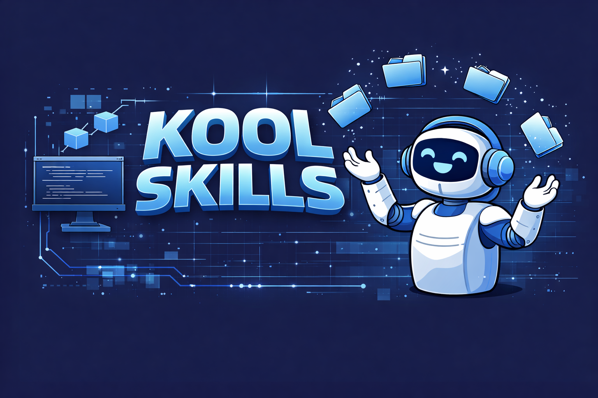

# kool-skills



A collection of Claude Code skills by [Kostas Morfis](https://github.com/koolhandluke).

## Skills

| Skill | Description |
|-------|-------------|
| [status-report](status-report/) | Generates daily status reports from Jira, GitHub, and Claude sessions |
| [example-skill](example-skill/) | Template for creating new skills |

## Installation

### Install the full collection

```sh
claude plugin install github:koolhandluke/kool-skills
```

### Install a single skill

```sh
claude plugin install github:koolhandluke/kool-skills/status-report
claude plugin install github:koolhandluke/kool-skills/example-skill
```

### Manual install

Clone the repo and install from a local path:

```sh
git clone https://github.com/koolhandluke/kool-skills.git
claude plugin install ./kool-skills                   # full collection
claude plugin install ./kool-skills/status-report     # single skill
```

## Creating a New Skill

Use the `example-skill` as a starting point:

1. Copy `example-skill/` to `your-skill-name/`
2. Rename inner directories and files to match your skill name
3. Update `plugin.json` with your skill's name, description, and version
4. Write your skill content in `SKILL.md`
5. Add an entry to `.claude-plugin/marketplace.json`

## License

MIT
